# Prism

Prism é um aplicativo de finanças projetado para proporcionar uma visão multifacetada e detalhada do seu gerenciamento
financeiro. Com uma interface intuitiva e recursos avançados, o Prism ajuda você a controlar suas despesas, planejar seu
orçamento e alcançar seus objetivos financeiros com clareza e eficiência.

## Instalação

Para instalar o Prism, siga as instruções abaixo:

1. Clone o repositório do Prism em sua máquina local.
2. Abra o terminal e navegue até o diretório do projeto.
3. Execute o comando `flutter run` para compilar e instalar o aplicativo em seu dispositivo.
4. Pronto! O Prism está instalado e pronto para uso.

## Interface do Usuário

O Prism possui uma interface de usuário intuitiva e fácil de usar, projetada para fornecer uma experiência de
gerenciamento financeiro eficaz e agradável.

<table>
  <tr>
    <td>
      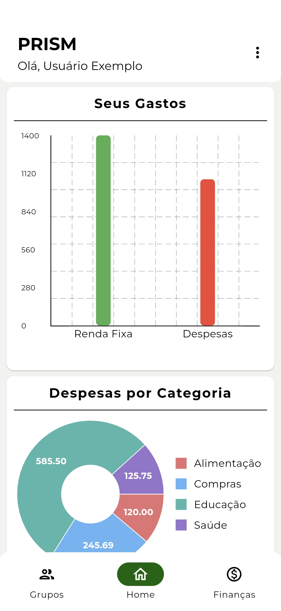
      
<em>Figura 1: Home.</em>

    </td>
    <td>
      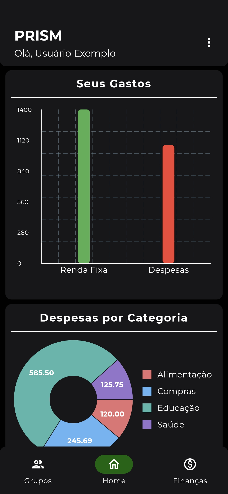
      
<em>Figura 2: Home - Tema Escuro.</em>

    </td>
    <td>
      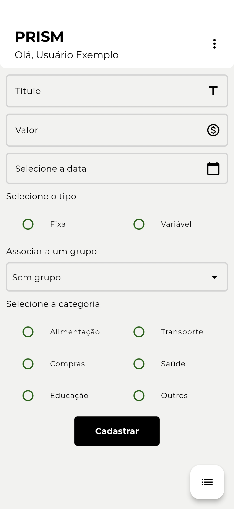
      
<em>Figura 3: Formulário Finança.</em>

    </td>
    <td>
      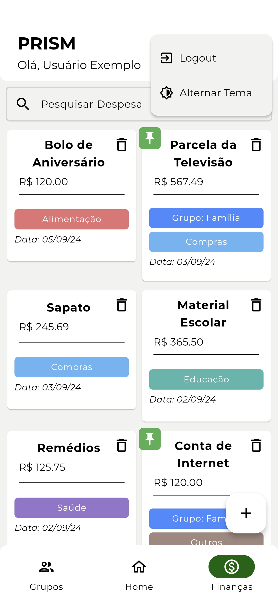
      
<em>Figura 4: Lista de Finanças.</em>

    </td>
  </tr>
</table>

  
Mais Interfaces

   
  <table>
    <tr>
      <td>
        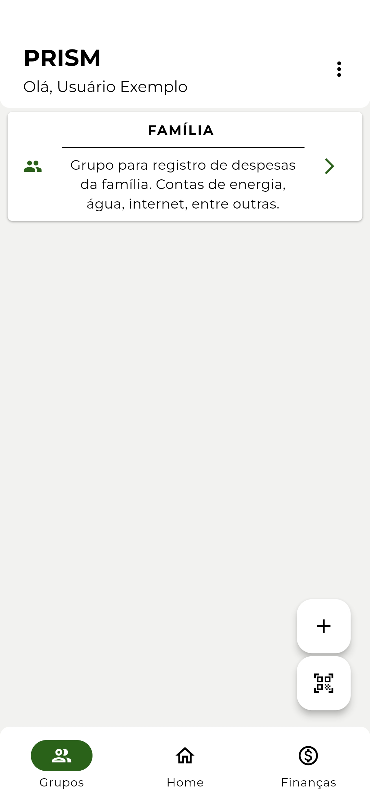
        
<em>Figura 5: Lista de Grupos.</em>

      </td>
      <td>
        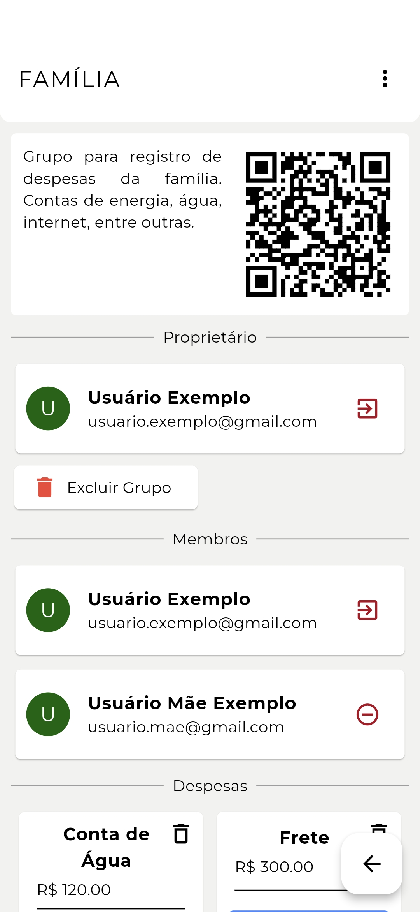
        
<em>Figura 6: Grupo.</em>

      </td>
      <td>
        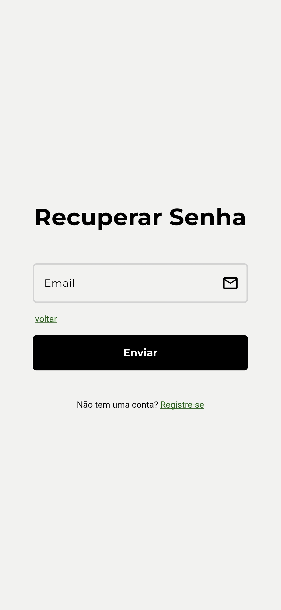
        
<em>Figura 7: Recuperação de Senha.</em>

      </td>
      <td>
        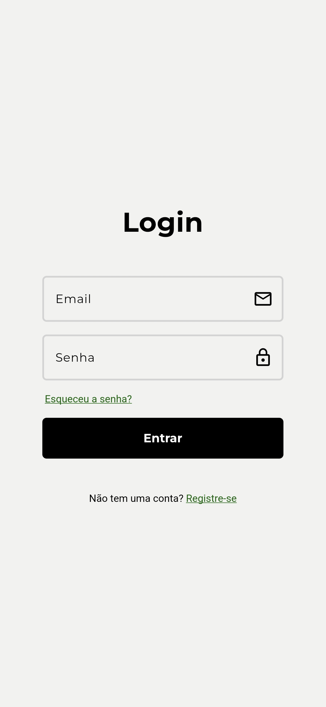
        
<em>Figura 8: Login.</em>

      </td>
    </tr>
    <tr>
      <td>
        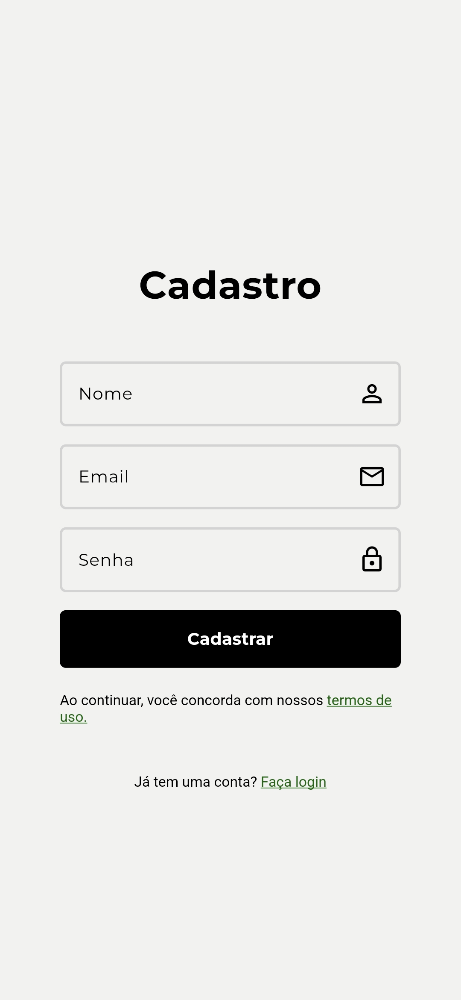
        
<em>Figura 9: Registro.</em>

      </td>
      <td>
        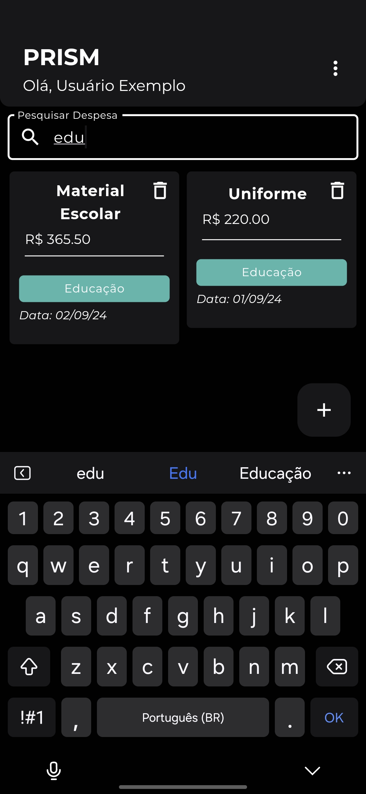
        
<em>Figura 10: Filtro de Pesquisa.</em>

      </td>
      <td>
        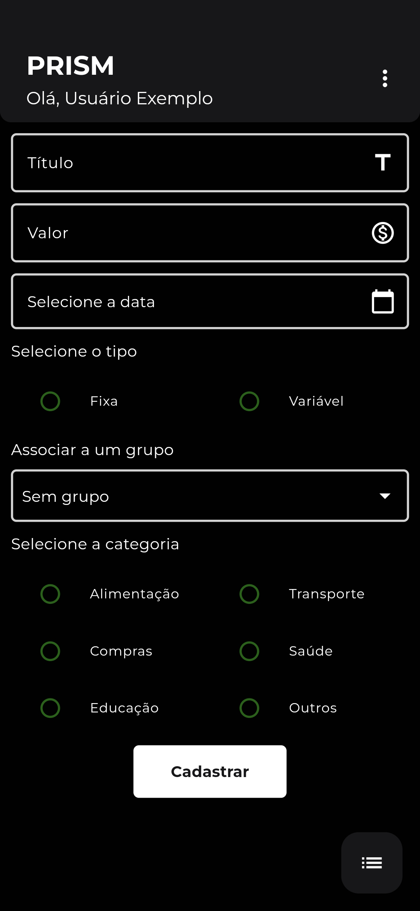
        
<em>Figura 11: Formulário - Tema Escuro.</em>

      </td>
      <td>
        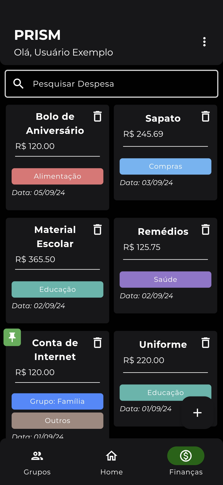
        
<em>Figura 12: Lista de Finanças - Tema Escuro.</em>

      </td>
    </tr>
  </table>

## Funcionalidades

O Prism oferece uma variedade de funcionalidades para ajudá-lo a gerenciar suas finanças de forma eficaz. Algumas das
principais funcionalidades incluem:

- **Rastreamento de Despesas**: Registre suas despesas diárias e categorize-as para uma melhor organização.
- **Controle de Orçamento**: Defina sua renda mensal e acompanhe seus gastos para garantir que você esteja dentro do seu
  orçamento.
- **Gráficos**: Visualize seus dados financeiros em gráficos detalhados para uma melhor compreensão.
- **Grupos de Compartilhamento**: Crie grupos de compartilhamento para gerenciar suas finanças em conjunto com amigos e
  familiares.
- **Avaliação de Gastos ao Longo do Tempo**: Visualize seus gastos ao longo do tempo para identificar padrões e
  tendências.

## Recursos Adicionais

Além das funcionalidades principais, o Prism também oferece uma série de recursos adicionais para melhorar sua
experiência de gerenciamento financeiro. Alguns dos recursos adicionais incluem:

- **Filtros de Pesquisa**: Filtre suas transações por data, categoria e título para encontrar informações específicas
  rapidamente.
- **Temas Personalizados**: Escolha o tema que melhor se adapta ao seu estilo e preferências.

## Tecnologias Utilizadas

O Prism foi desenvolvido utilizando as seguintes tecnologias:

- **Flutter**: Framework de desenvolvimento de aplicativos multiplataforma.
- **Dart**: Linguagem de programação utilizada pelo Flutter.
- **Firebase**: Plataforma de desenvolvimento de aplicativos móveis do Google.